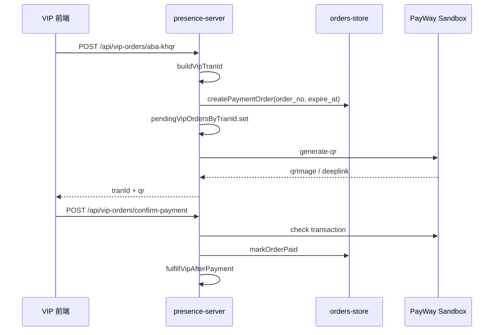

# ABA PayWay Sandbox — Phase 1 实施方案

> 范围：仅 Sandbox；不实现 Callback；不接入 Production；不修改 `telegram-novel-admin` 管理后台。

---

## 1. 目标

在保持现有 VIP 支付流程可用的前提下，完成以下 Phase 1 能力：

1. 通过环境变量配置 ABA Sandbox（Merchant ID、API Key、API URL）
2. 启用 ABA KHQR 支付方式（真实 Sandbox QR，非仅 UI Mock）
3. 将现有 checkout / KHQR 流程接入 `orders-store`
4. 创建订单时生成 `order_no`
5. 创建支付订单时写入 `orders-store`
6. 新增 `expire_at` 字段
7. 双写保留 `pendingVipOrdersByTranId`，确保 confirm / demo / 历史逻辑兼容

---

## 2. 现状摘要

| 模块 | 当前状态 |
|------|----------|
| PayWay 集成 | `server/payway.js` 已支持 KHQR、Hosted Checkout、Sandbox/Production URL 分支 |
| 待支付订单 | 存于 `pendingVipOrdersByTranId`（内存 + `presence-data.json`） |
| 成功订单 | 存于 `vipOrdersByUser`，订单 ID 使用 `buildVipOrderId()`（`VIP` 前缀） |
| 业务订单号 | 前端 `src/lib/orderNo.js` 有 `buildOrderNo()`；后端尚无统一 `order_no` 生成 |
| KHQR API | `POST /api/vip-orders/aba-khqr` 已实现，需配置凭证后生效 |
| orders-store | **尚不存在**，Phase 1 新建 |

---

## 3. 新增文件清单

| 文件 | 说明 |
|------|------|
| `server/orders-store.js` | 订单持久化存储（`orders-data.json`） |
| `server/order-no.js` | 服务端 `order_no` 生成（与 `src/lib/orderNo.js` 规则一致） |
| `.env.example` | Sandbox 环境变量示例（不含真实密钥） |
| `docs/aba-sandbox-phase1-implementation-plan.md` | 本文档 |

---

## 4. 修改文件清单

| 文件 | 修改类型 | 说明 |
|------|----------|------|
| `server/payway.js` | 小改 | Sandbox 环境变量统一、`PAYWAY_API_URL` 推导端点、仅 Sandbox 模式 |
| `server/presence-server.js` | 主改 | 启动 `orders-store`；checkout / aba-khqr / confirm 接入双写 |

---

## 5. 明确不修改

- `telegram-novel-admin`（独立管理后台项目）
- `src/components/AdminOrdersFilterPanel.jsx` 等本仓库内管理 UI
- `src/pages/VipPage.jsx`、`VipAbaKhqrPage.jsx` 等前端主流程（Phase 1 可不改）
- Callback 路由与 Webhook 处理
- Production 环境密钥与 URL 逻辑扩展

---

## 6. 修改原因

### 6.1 `server/orders-store.js`（新建）

**原因：** Phase 1 核心需求是将支付订单从内存 Map 升级为可持久化、可查询的订单层，为后续 Callback、对账、管理端查询奠定基础。

**职责：**

- 数据文件：`{PERSISTENT_DATA_DIR}/orders-data.json`
- 参考 `novels-store.js` / `app-filters-store.js` 的读写模式
- 导出 API：
  - `initOrdersStore()`
  - `createPaymentOrder(input)`
  - `getOrderByTranId(tranId)`
  - `getOrderByOrderNo(orderNo)`
  - `markOrderPaid(tranId, paidAt)`
  - `markOrderFailed(tranId, reason)`
  - `listOrdersByTelegramUserId(telegramUserId)`

**订单字段（草案）：**

```js
{
  order_no,           // YYYYMMDDHHmmss + 序号
  tran_id,            // PayWay 交易号（沿用 buildVipTranId）
  telegram_user_id,
  member_id,
  plan_id,
  amount,
  currency,           // 默认 USD
  status,             // pending | paid | failed | expired
  payment_channel,    // aba_khqr | payway_hosted
  created_at,         // 毫秒时间戳
  expire_at,          // 毫秒时间戳
  paid_at,            // 毫秒时间戳，未支付为 0
  payway_env: 'sandbox'
}
```

### 6.2 `server/order-no.js`（新建）

**原因：** 满足「创建订单时生成 `order_no`」，并与前端 `buildOrderNo()`、管理端演示订单号格式保持一致。

**规则：** `YYYYMMDDHHmmss` + 2 位同秒序号；通过 `orders-store` 计数避免碰撞。

### 6.3 `server/payway.js`（小改）

**原因：**

- 对齐用户提供的三项凭证：Merchant ID、API Key、API URL
- Phase 1 仅 Sandbox，避免误连 Production
- 为 `expire_at` 提供 QR 有效期（`PAYWAY_QR_LIFETIME_MIN`）

**变更要点：**

- `PAYWAY_MERCHANT_ID` — Merchant ID
- `PAYWAY_API_KEY` — API Key（兼容 `PAYWAY_PUBLIC_KEY`）
- `PAYWAY_API_URL` — API 根地址，例如：
  `https://checkout-sandbox.payway.com.kh/api/payment-gateway/v1`
- 由根地址推导：
  - `/payments/purchase`
  - `/payments/check`
  - `/payments/generate-qr`
- 保留 `PAYWAY_CHECKOUT_URL` / `PAYWAY_CHECK_URL` / `PAYWAY_QR_URL` 作为显式覆盖
- Phase 1 要求 `PAYWAY_SANDBOX=1`（或未设置时默认 Sandbox）；检测到 production 域名且未显式允许时，`isPayWayConfigured()` 返回 false
- 导出 `getPayWaySandboxStatus()`（不泄露密钥）
- 导出 `getPayWayQrLifetimeMinutes()` 供 `expire_at` 计算

### 6.4 `server/presence-server.js`（主改）

**原因：** 现有 VIP checkout / KHQR 端点已具备业务逻辑，Phase 1 在**不删除** `pendingVipOrdersByTranId` 的前提下，增加 `orders-store` 双写与状态同步。

**变更要点：**

- 启动时调用 `initOrdersStore()`
- 启动日志输出 PayWay Sandbox 配置状态
- `/api/health/persistence`（可选）增加 `orders-data.json` 路径与订单数量

### 6.5 `.env.example`（新建）

**原因：** 明确 Sandbox 必填项，便于 Railway / 本地配置，避免密钥写入代码库。

---

## 7. 实施顺序

```
Step 1  server/order-no.js
        └─ 订单号生成规则

Step 2  server/orders-store.js
        └─ 持久化、CRUD、同秒序号

Step 3  server/payway.js
        └─ Sandbox 环境变量与 API URL 推导

Step 4  server/presence-server.js
        ├─ initOrdersStore + 启动日志
        ├─ POST /api/vip-orders/checkout → orders-store 双写
        ├─ POST /api/vip-orders/aba-khqr → orders-store 双写 + expire_at
        └─ POST /api/vip-orders/confirm-payment → markOrderPaid

Step 5  .env.example
        └─ 文档化 Sandbox 变量

Step 6  本地验证
        ├─ 未配置 PayWay → demo / mock 仍可用
        ├─ 配置 Sandbox → KHQR 返回真实 QR
        └─ orders-data.json 含 order_no、expire_at、status
```

---

## 8. Sandbox 配置方案

### 8.1 环境变量

| 变量 | 必填 | 说明 |
|------|------|------|
| `PAYWAY_SANDBOX` | 是 | 设为 `1` 或 `true` |
| `PAYWAY_MERCHANT_ID` | 是 | ABA 提供的 Merchant ID |
| `PAYWAY_API_KEY` | 是 | ABA 提供的 API Key |
| `PAYWAY_API_URL` | 是 | API 根地址（见下） |
| `PAYWAY_APP_PUBLIC_URL` | 推荐 | 前端公网地址，用于 return deeplink |
| `PAYWAY_QR_LIFETIME_MIN` | 可选 | QR 有效期（分钟），默认 30 |

### 8.2 API URL 格式

推荐使用**根路径**（不含具体 endpoint）：

```
https://checkout-sandbox.payway.com.kh/api/payment-gateway/v1
```

代码自动拼接：

- `{PAYWAY_API_URL}/payments/purchase` — Hosted Checkout
- `{PAYWAY_API_URL}/payments/check` — 交易查询
- `{PAYWAY_API_URL}/payments/generate-qr` — KHQR 生成

若凭证提供的是完整 endpoint URL，实现时需在 `payway.js` 做兼容解析（去掉末尾 path 或按完整 URL 直接使用）。

### 8.3 Railway 配置示例

在 `telegram-novel-app` 服务 Variables 中设置：

```env
PAYWAY_SANDBOX=1
PAYWAY_MERCHANT_ID=<你的 Merchant ID>
PAYWAY_API_KEY=<你的 API Key>
PAYWAY_API_URL=https://checkout-sandbox.payway.com.kh/api/payment-gateway/v1
PAYWAY_APP_PUBLIC_URL=https://<你的 Netlify 域名>
PAYWAY_QR_LIFETIME_MIN=30
```

### 8.4 配置生效判断

- `isPayWayConfigured()` 为 true → KHQR / Hosted Checkout 走真实 Sandbox
- 为 false → 前端 fallback 到 demo `purchase` 或 UI Mock（现有行为保留）

---

## 9. KHQR 接入方案

### 9.1 现有链路（保持不变）

```
VipPage
  → startViewerVipAbaKhqr(planId)
  → POST /api/vip-orders/aba-khqr
  → generateAbaKhqrPayment()  [payment_option: abapay_khqr]
  → 返回 qrImage / qrString / abapayDeeplink
  → VipAbaKhqrPage 展示 QR
```

### 9.2 Phase 1 增强点

在 `POST /api/vip-orders/aba-khqr` 内，于调用 PayWay 之前：

1. 生成 `tran_id`（`buildVipTranId`，不变）
2. 调用 `orders-store.createPaymentOrder()`：
   - 生成 `order_no`
   - 设置 `expire_at = now + PAYWAY_QR_LIFETIME_MIN * 60 * 1000`
   - `payment_channel: aba_khqr`
   - `status: pending`
3. **双写** `pendingVipOrdersByTranId`（保留现有字段 + 可选附加 `orderNo`、`expireAt`）
4. 调用 `generateAbaKhqrPayment()`
5. QR 失败 → `markOrderFailed` + 删除 pending Map 中对应项（与现逻辑一致）
6. 响应可增加 `orderNo`、`expireAt`（前端 Phase 1 可不消费）

### 9.3 Hosted Checkout 同步接入

`POST /api/vip-orders/checkout` 同样写入 `orders-store`：

- `payment_channel: payway_hosted`
- `expire_at` 可与 KHQR 共用 `PAYWAY_QR_LIFETIME_MIN`，或 Hosted 使用独立默认值（实现时二选一并文档化）

### 9.4 支付确认

`POST /api/vip-orders/confirm-payment`：

1. 仍从 `pendingVipOrdersByTranId` 读取（兼容）
2. `checkPayWayTransaction(tranId)`（不变，Phase 1 无 Callback）
3. 成功后 `orders-store.markOrderPaid(tranId)`
4. `fulfillVipAfterPayment()` / `createSuccessfulVipOrderForViewer()` 不变

---

## 10. orders-store 对接方案

### 10.1 双写策略

| 操作 | orders-store | pendingVipOrdersByTranId |
|------|--------------|--------------------------|
| 创建 checkout / KHQR | ✅ createPaymentOrder | ✅ set（保留） |
| QR / checkout 失败 | ✅ markOrderFailed | ✅ delete |
| confirm 成功 | ✅ markOrderPaid | ✅ status → paid |
| confirm 幂等 | ✅ 已 paid 则跳过 | ✅ fulfilledVipTranIds |

**原则：** 新逻辑以 `orders-store` 为准；旧 Map 继续服务 confirm、演示与 `presence-data.json` 中已有 pending 数据。

### 10.2 字段映射

| orders-store | 现有 pending Map | PayWay |
|--------------|------------------|--------|
| `order_no` | （新增，可选挂在 pending） | — |
| `tran_id` | `tranId` | `tran_id` |
| `plan_id` | `planId` | custom_fields |
| `amount` | `amount` | `amount` |
| `expire_at` | （新增） | `lifetime`（分钟） |
| `payment_channel` | `paymentChannel` | `payment_option` |

### 10.3 与 VIP 订单历史的关系

- `vipOrdersByUser`（`POST /api/vip-orders/list`）Phase 1 **不改行为**，仍展示已履约成功单
- `orders-store` 记录含 `pending` 状态，供后续 Phase 扩展订单列表、过期扫描
- 履约成功时可在 `createSuccessfulVipOrderForViewer` 中关联 `order_no`（可选，不破坏现有 `id` 字段）

### 10.4 持久化

- 文件：`{PERSISTENT_DATA_DIR}/orders-data.json`
- Railway：与 `novels-data.json` 相同，挂载 Volume 至 `/data`
- 启动：`initOrdersStore()` 在 `loadPersistedMembers()` 之后或并行初始化

### 10.5 数据流



---

## 11. 兼容与约束

| 约束 | 处理方式 |
|------|----------|
| 不删除现有代码 | `pendingVipOrdersByTranId`、`vipOrdersByUser` 全部保留 |
| 不改管理后台 | 不接 admin API；`AdminOrdersFilterPanel` 不动 |
| 不实现 Callback | 仍靠 `confirm-payment` + `checkPayWayTransaction` |
| 仅 Sandbox | `payway.js` 限制 Production URL |
| 未配置 PayWay | demo purchase / UI mock 路径不变 |

---

## 12. Phase 1 验收标准

1. 配置 Sandbox 后，`/api/vip-orders/aba-khqr` 返回真实 QR（非 `payway_not_configured`）
2. `orders-data.json` 出现新记录，含 `order_no`、`expire_at`、`status: pending`
3. Hosted checkout 同样写入 `orders-store`
4. `confirm-payment` 成功后订单状态为 `paid`，VIP 权益正常开通
5. 未配置 PayWay 时，demo / mock 流程仍可用
6. 无 Callback、无 Production、管理后台无改动

---

## 13. 后续 Phase（不在本次范围）

- PayWay Callback Webhook
- Production 环境与密钥轮换
- 订单过期自动扫描（`expire_at` → `expired`）
- 管理后台对接真实 `orders-store` API
- 前端订单历史展示 pending / 过期状态
